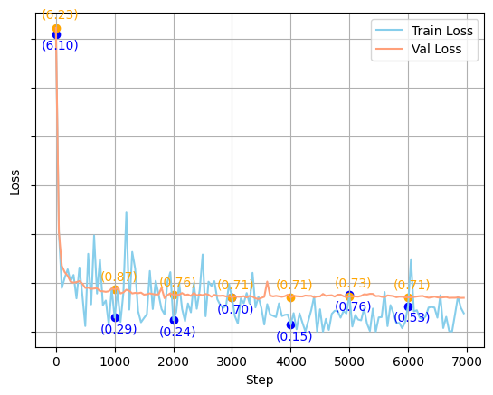
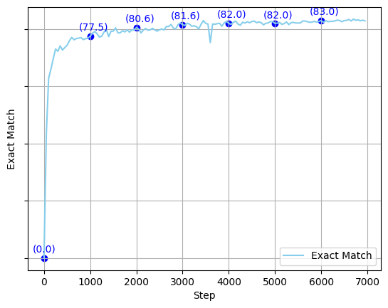

# ADL-HW1

### Q1: Data Preprocessing

* Tokenizer:

    * Describe in detail about the tokenization algorithm you use. You need to explain what it does in your own ways.

        >我在兩個模型使用的 Tokenizer 都是 BertTokenizer，而 BertTokenizer 是使用 WordPiece 的演算法，一個句子會根據詞彙表被分成很多個 subword，每個 subword 在詞彙表中都有其對應的 token，而如果 subword 是某個單字的一部份的話，WordPiece 會在 subword 前面加上 ##，表示其為某單字的一部份。除此之外，WordPiece 還有其他特殊的 token，例如：[CLS]、[SEP]、[UNK]、[PAD]，分別代表著句子的開頭、結尾、未知的詞彙、以及填充的詞彙。例如: "I am loving you" 會被轉換成 ["[CLS]", "I", "am", "love", "##ing", "you", "[SEP]"]。

        >而在中文的部分，我原本以為 BertTokenizer 會使用 WordPiece 的演算法，但根據 [bert 中的 README.md](https://github.com/google-research/bert/blob/master/README.md) 所提到 "We use character-based tokenization for Chinese, and WordPiece tokenization for all other languages." 所以我認為 BertTokenizer 在中文的部分是使用 character-based tokenization。他會直接將中文句子裡的每一個字直接轉換成一個個的 token 例如：「今天天氣真好」會被轉換成 ["今", "天", "天", "氣", "真", "好"]，然後再轉換成對應的 id。以下是我自己測試的程式碼範例：
    
    
* Answer Span: 
    
    * How did you convert the answer span start/end position on characters to position on tokens after BERT tokenization?
    
        >首先，我在做 BERT tokenization 的時候，會針對較長的文章（context）進行截斷，分成多句，而每句之間會有重疊的部分，確保答案不會被我們截斷，導致找不到答案，然後會將問題與文章每個被截斷的句子結合起來一起進行 tokenization。

        >接著，因為被 tokenized 過後的內容，包含問題與文章中的句子，而由於我們確認答案一定在文章中，因此我們需要先定位出文章中的句子在 tokenized 過後的內容的哪個部分。被 tokenized 過後的內容中有一個屬性 squence_ids，其內容包含 0、1 和 None，分別代表問題、文章句子以及特殊 token（[CLS]、[SEP]...），可以幫助我們定位出文章中的句子。

        >找出文章中的句子在 tokenized 過後的內容的哪個部分後，我們就可以確定我們只對文章中的句子進行搜索。而下一步則是先確認答案是否有在這段被截斷的句子中，如果沒有的話，則搜尋下一段被截斷的句子，直到找到答案為止。而在被 tokenized 過後的內容中有一個 key = "offset"，其 value 記錄著每個 token 的開始跟結束的位置。另外，我們可以從 train.json 中的 answer 知道正確答案的起始位置跟結束位置，因此我們可以透過比較 offset 跟 answer 來確認正確答案位於 tokenized 過後的內容的哪個部分。

    * After your model predicts the probability of answer span start/end position, what rules did you apply to determine the final start/end position?
        
        >在模型預測出答案的起始位置跟結束位置的機率後，我們會先將起始位置的機率與結束位置的機率個別排序，並個別選擇前 20 個最高的機率，然後遍歷 400 種組合（機率前 20 高的起始位置配上機率前 20 高的結束位置），確認每一種組合是否符合以下條件：
        >1. 起始和結束位置的 index 必須小於 tokenized 過後的內容（問題＋截斷的句子）的長度
        >2. 起始和結束位置不是特殊 token（[CLS]、[SEP]...）
        >3. 起始位置的 index 必須小於結束位置的 index（答案長度不可以為負的）
        >4. 答案長度（結束位置-起始位置的 index+1）要小於 30 個 token。（考量到正確答案其實都不會太長）

        >符合以上條件的組合中，我們會選擇起始位置跟結束位置的機率相加最高的組合作為最終起始位置跟結束位置的選擇。

### Q2: Modeling with BERTs and their variants
* Describe

    <u>(a) Paragraph Selection</u>

    * Your model.

        >我使用 BertForMultipleChoice 來做 Paragraph Selection，預訓練模型則使用 bert-base-chinese。
    * The performance of your model.

        > Eval accuracy: 0.9627783316716517
    * The loss function you used.

        > CrossEntropyLoss
    * The optimization algorithm (e.g. Adam), learning rate and batch size.
    
        > AdamW, learning rate=3e-5, batch_size=8

    
    <u>(b) Span Selection (Extractive QA)</u>

    * Your model.

        >我使用 BertForQuestionAnswering 來做 Paragraph Selection，預訓練模型則使用 bert-base-chinese。
    * The performance of your model.

        > Eval_exact_match: 79.79395147889664

        > Eval_f1: 79.79395147889664
    * The loss function you used.

        > CrossEntropyLoss
    * The optimization algorithm (e.g. Adam), learning rate and batch size.
    
        > AdamW, learning rate=3e-5, batch_size=8

* Try another type of pre-trained LMs and describe

     <u>(a) Paragraph Selection</u>
    * Your model.

        >我一樣使用 BertForMultipleChoice 來做 Paragraph Selection，但預訓練模型則使用 chinese-roberta-wwm-ext。
    * The performance of your model.

        > Eval accuracy: 0.9594549684280492
    * The difference between pre-trained LMs (architecture, pretraining loss, etc.)

        > bert-base-chinese 
        > 1. 採用 BERT 架構，並且訓練在Masked Language Model （MLM） 和 Next Sentence Prediction （NSP） 任務上。
        > 2. 在訓練時只會遮蔽單一個中文字（character），然後預測被遮蔽的字是什麼。

        > chinese-roberta-wwm-ext 
        > 1. 採用 RoBERTa-like BERT 架構，只簡單取消 Next Sentence Prediction（NSP） 的 loss，但保留 paired-input，並且沒有使用 dynamic masking。
        > 2. 在訓練時引入 Whole Word Masking （WWM）技術，利用傳統的 Chinese Word Segmentation （CWS）工具將句子切割成多個詞（Word），調整中文資料以適應 WWM 的遮蔽策略，遮蔽整個詞，而不是單個字，有助於提升模型對於中文的理解能力。
        > 3. 在訓練資料上，使用了更多的中文資料，除了中文維基百科外，還有其他百科類網站、新聞、問答等數據，總詞數達 5.4B，使得模型對於繁體中文的理解能力更好。
        > 4. 參考來源：[Chinese-BERT-wwm github](https://github.com/ymcui/Chinese-BERT-wwm)、[Pre-Training with Whole Word Masking forChinese BERT](https://ieeexplore.ieee.org/document/9599397)

    
    <u>(b) Span Selection (Extractive QA)</u>
    * Your model.

        >我一樣使用 BertForQuestionAnswering 來做 Paragraph Selection，但預訓練模型則使用 chinese-roberta-wwm-ext-large。
    * The performance of your model.

        > Eval_exact_match: 84.18079096045197

        > Eval_f1: 84.18079096045197
    * The difference between pre-trained LMs

        > 同 <u>(a) Paragraph Selection</u> 所提到的，只不過 chinese-roberta-wwm-ext-large 模型大小比 chinese-roberta-wwm-ext 模型更大。

### Q3: Curves
* Plot the learning curve of your span selection (extractive QA) model. You can plot both the training and validation set or only one set. Please make sure there are at least 5 data points in each curve.

    * Learning curve of the loss value
        >我以每 50 個 step 紀錄一次 loss，training loss 我是記錄當下 step 的 loss，也就是部分（batch）訓練資料的 loss，而 validation loss 則是記錄當下模型對於全部驗證資料集的 loss。而圖上有標示的值則是每 1000 個 step 的 loss。

        
    * Learning curve of the Exact Match metric value
        >我以每 50 個 step 紀錄一次 validation Exact Match。而圖上有標示的值則是每 1000 個 step 的 Exact Match。

        

### Q4: Pre-trained vs Not Pre-trained
* Train a transformer-based model (you can choose either paragraph selection or span selection) from scratch (i.e. without pretrained weights).

    * The configuration of the model and how do you train this model (e.g., hyper-parameters).

        > 我選擇 span selection 來做，而的訓練方式跟使用預訓練模型時一樣，只是跳過讀取預訓練的模型的權重。而我使用的超參數如下皆跟使用預訓練模型時一樣，而未提及的參數皆使用預設值：
        > * tokenizer: BertTokenizer
        > * model_type bert
        > * learning_rate: 3.0e-05
        > * gradient_accumulation_steps: 1
        > * per_device_train_batch_size: 8
        > * max_seq_length: 512
        > * num_train_epochs: 2
        > * --doc_stride 128

    * The performance of this model v.s. BERT.

        <u>(a) This model </u>
        > 沒有預訓練模型的結果如下：

        > Eval_exact_match: 4.885343968095713

        > Eval_f1: 4.885343968095713
        <u>(b) BERT </u>

        > 我有使用 BERT 預訓練模型所訓練出來的模型，表現最好的是使用 chinese-roberta-wwm-ext-large作為預訓練模型，表現結果如下：

        > Eval_exact_match: 84.18079096045197
        
        > Eval_f1: 84.18079096045197

### Q5: Bonus
* Instead of the paragraph selection + span selection pipeline approach, train a end-to-end transformer-based model and describe.

    * Your model.

        >我使用 BertForQuestionAnswering 來做 end to end 的 Question Answering，預訓練模型使用 longformer-chinese-base-4096，我將原本的四個 paragraph 合併成一個 paragraph，將問題與 paragraph 餵給模型，讓模型直接預測出答案的起始位置跟結束位置。如同前面的 span selection，只是因為要輸入較長的 paragraph，所以選擇 longformer-chinese-base-4096 作為預訓練模型。
    * The performance of your model.

        > 我只訓練了 2 個週期，模型的表現如下：

        > Eval_exact_match: 16.1847789963443

        > Eval_f1: 16.1847789963443
    * The loss function you used.

        > CrossEntropyLoss
    * The optimization algorithm (e.g. Adam), learning rate and batch size.
    
        > AdamW, learning rate=3e-5, batch_size=12

