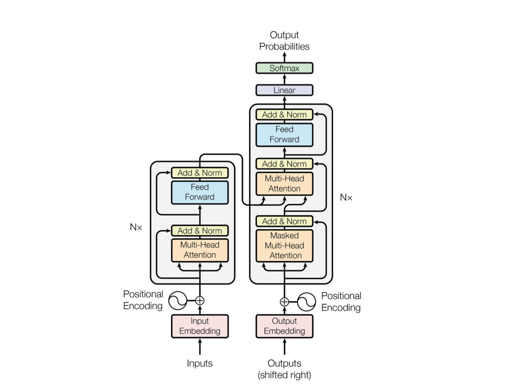

# ADL-HW2

### Q1: Model

* Model:

    * Describe the model architecture and how it works on text summarization.

        >根據 [mT5 的論文](https://aclanthology.org/2021.naacl-main.41/)，指出模型架構與 T5 相似，而在 [T5 的論文](https://arxiv.org/abs/1910.10683)中，指出模型架構是使用標準的 encoder-decoder Transformer。如下：
        
        在 text summarization 的任務中，我們會將 task-specific prefix ("summarize: ") 加在要 summarize 的文章前面，然後將文章與 task-specific prefix 當作輸入一起餵給模型，模型會先將輸入 encode 成一組向量。而在 decoder 的部分，會先將特殊的 token 作為 decoder 的輸入，然後將 decoder 的輸入先做 self attention 後再與 encoding 的結果做 cross attention ，這些動作重複幾遍後，我們會得到最終的輸出。而這個輸出是下一個字的機率分布，我們會根據生成策略來挑選下一個字，並與之前 decoder 的輸入一起當作 decoder 的輸入，再進行 decode，不斷重複這個過程，一個字一個字生成出 summary，直到生成結束的 token 為止。
    
* Preprocessing: 
    
    * Describe your preprocessing (e.g. tokenization, data cleaning and etc.)
    
        >在 preprocessing 的時候，我將要 summarize 的文章前面加上 task-specific prefix ("summarize: ")，然後將文章與 task-specific prefix 一起當作輸入。而在 tokenization 的部分，我使用的是 mT5 的 tokenizer，他使用 unigram 的方式，將一串句子切分成不同的子詞組合，根據每一組的子詞組合內每個子詞機率相乘，取乘積最大的子詞組合作為分詞的結果。

### Q2: Training
* Hyperparameter

    * Describe your hyperparameter you use and how you decide it.

        >* max_input_length: 1024，因為在 mT5 預訓練時，就使用 1024 作為輸入文本的長度。
        >* max_output_length: 128，因為我們要產生新聞的標題，所以輸出長度應該不用太長。
        >* per_device_train_batch_size: 2，因為這個數值差不多可以剛好用完 GPU 的所有記憶體。
        >* num_train_epochs: 12，因為我只 train 兩個 epoch 無法過 baseline，所以我就把 epoch 數增加到 12，並且在每 500 個 steps 時，紀錄其在 public.jsonl 的 rouge score，並且將模型儲存下來，最後挑選表現最好的模型當作最終的模型。
        >* 其餘參數皆使用預設值。如下：gradient_accumulation_steps: 1, learning_rate: 5e-05, lr_scheduler_type: linear, warmup_steps: 0, optimizer_type: adamw, weight_decay: 0.0

* Learning Curves
    * Plot the learning curves (ROUGE versus training steps)

        > 

### Q3: Generation Strategies
* Stratgies

    * Describe the detail of the following generation strategies:
        * Greedy Search
            > 在生成文字的每個階段，都會選擇機率最大的字當作下一個字。
        * Beam Search
            > 在生成文字的每個階段，都會選擇機率最大的前 k 個字當作下一個字的候選字，並且將這 k 個字與之前生成的字組合成 k 平方個句子，然後再從這 k 平方個句子組合中選擇機率最大的前 k 個句子，重複這個過程，直到生成結束的 token 為止。最後會留下 k 個句子，然後演算法會選擇其中機率最大的句子作為最終的輸出。
        * Top-k Sampling
            > 在生成文字的每個階段，會先選擇機率最大的前 k 個字，然後再從這 k 個字中隨機選擇一個字當作下一個字。
        * Top-p Sampling
            > 在生成文字的每個階段，會從機率最大的字往機率小的字開始選擇候選字，已經被選擇成候選字的機率總和如果大於等於某個機率 p 的話，就停止選擇候選字，然後再從這些已選定的候選字中隨機選擇一個字當作下一個字。
        * Temperature
            > 在過 softmax 之前，先將模型得出的分數 (score) 先除以 T (temperature)，然後再過 softmax，當 T 越大時，出來的機率分布會比較接近均勻分布，分數的高低與機率較接近線性關係；而當 T 越小時，出來的機率分布會越尖銳 (越集中)，分數比較高的字機率會很接近 1，分數低的則會很接近 0。

* Hyperparameters
    * Try at least 2 settings of each strategies and compare the result.
        
        | Generation Strategies | rouge-1 | rouge-2 | rouge-l |
        | --------------------- | ------- | ------- | ------- |
        | Greedy Search         | 24.37   | 8.78    | 21.89   |
        | Beam Search (k = 3)   | 25.93   | 10.24   | 23.30   |
        | Beam Search (k = 5)   | 26.02   | 10.46   | 23.36   |
        | Beam Search (k = 10)  | <b> 26.06   | <b> 10.54   | <b> 23.43   |
        | Beam Search (k = 20)   | 25.94   | 10.48   | 23.32   |
        | Top-k Sampling (k = 3)| 22.90   | 7.46    | 20.22   |
        | Top-k Sampling (k = 5)| 22.41   | 7.12    | 19.84   |
        | Top-k Sampling (k = 10)| 20.95  | 6.23    | 18.40   |
        | Top-p Sampling (p = 0.1)| 24.34  | 8.78    | 21.85   |
        | Top-p Sampling (p = 0.2)| 24.28  | 8.70    | 21.70   |
        | Top-p Sampling (p = 0.5)| 23.18  | 7.88    | 20.69   |
        | Top-p Sampling (p = 0.8)| 20.71  | 6.32    | 18.28   |
        | Temperature (T = 0.8)  | 24.35   | 8.80    | 21.88   |
        | Temperature (T = 1.2)  | 24.40   | 8.83    | 21.91   |
        | Temperature (T = 2.0)  | 23.78   | 8.29    | 21.22   |

        > 以上結果都以 f1-score*100 作為比較指標，而 Temperature 是固定 Top-p Sampling (p = 0.1) 然後調整不同 T 的值。由上表可看出，Beam Search 的表現比 Greedy Search 好，而 Beam Search 的 k 值越大，表現越好，但是當 k = 10 時，表現就不會再有明顯的提升。而 Top-k Sampling 的表現比 Greedy Search 差，而且 k 值越大，表現越差。而 Top-p Sampling 的表現也比 Greedy Search 差，不過大部分表現比 Top-k Sampling 好，當 p 值越小，表現越好，但是當 p = 0.1 時，表現就不會再有明顯的提升。而 Temperature 的表現比 Top-p Sampling (p = 0.1) 好，當 T = 1.2 時，表現最好。而所有的 generation strategies 中，Beam Search (k = 10) 的表現最好。

        
    * What is your final generation strategy? (you can combine any of them)

        > 我的最終 generation strategy 是 Beam Search (k = 10)。